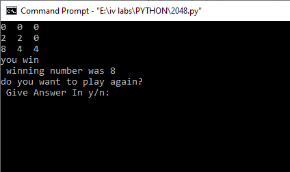

# py2048
## THE 2048 GAME
* The code contains the programs for the game '2048'.
* Python is used for programming.
### GAME RULES
* It starts with a grid having, a '2' anywhere on the grid.
* PLayer's aim is to generate the target number in the grid to win the game.
* Player will lose if he/she runs out of move, with the target number still not produced.
  #### THE GAME PLAY AND WIN/LOSE SITUATION
  * PLayer has to swipe the grid in the 4 directions according to the choice.
  * After each move a new '2' is spawned in the grid on empty spaces.
  * Swiping leads to the numberes shift to the last available empty space in the direction the grid is swiped.
  * PLayer has to produce a higher by fusing two similar numbers i.e only numbers whose Nth root is '2' can be produced.
  * If the player manages to prduce the target number before there is  no move left i.e, if all spaces are occupied given no two similar numbers are adjacent in both the directions, then the player wins!.
  * another important rule is that, if a number is produced by fusion of two numbers then that fused number is not fused again with itself in that same move.
  
### ABOUT THE CODE
1. It asks the user to input the grid size and winning number.(input 0 for default settings [5X5 grid with 2048 as winning number])
1. The game starts and the user has to input 'w','a','s' or 'd' for swiping the grid in up,left,down and right directions resp.
1. Every time the user makes a move the code access the elements of grid in that direction to swipe the element step by step, and the grid gets modified.
1. It checks the lose or win conditions at each move and if the numbers cannot be swiped then it asks to try some other move.
1. Other moves like 'e' and 'r'are provided to exit and restart the game at any point.
1. 'c' displays the controls anytime the user wants to.
1. The code displays if the player has lost or won and breaks out of the loop.

### WORKING OF CODE

  #### WASD MOVES
  Here is a simple example about how the code will work on making all the moves:

  __this is our sample grid__
  
  * now the user inputs 'w' that is the up swipe then the code enters the SWIPE function each time the player makes a move and swipes the numbers and modifies the grid in grid_modify according to the respective algorithm and as per the rules it gives this output

  __up swipe__
  
  * after modifying the grid the code checks evrytime if the SWIPE function had run, if it did then it spawns a 2 at random space.
  * now if the user hits 'a'.

  __left swipe__
  
  * same process is repeated and the left swipe algorithm is used.
  * now the user hits 's'

  __down swipe__
  

  * on each move the win or lose conditions are checked 
  * now if user inputs 'd'

  __right swipe__
  

  * When there is a win or lose situation the WIN_CHECK or LOSE_CHECK repectively returns a value which breaks the loop which is  designed to demand input from the user.
  
  #### INVALID MOVE
  This a sample grid where for the next move the user inputs 'd' so as per the algorithm no element of the grid is swiped so it doesnt returns a value hence not spawning a 2 and giving a message of "try some other move".
  
  __sample__
  
  
  __error__
  
  
  #### WIN AND LOSE
  * If either of the functions (WIN_CHECK AND LOSE_CHECK) returns a value then it breaks the loop for game play. And displays a message.
  * here is the example of it.
  
  __win__
 
 
 the print "winning number was 8" was just to tell that the input was 8 for winning number,actual code doesnt do that
 
 __lose__
 
 
 As we can see the grid is packed and the there is no adjacent like numbers in horizontal or vertical direction.

